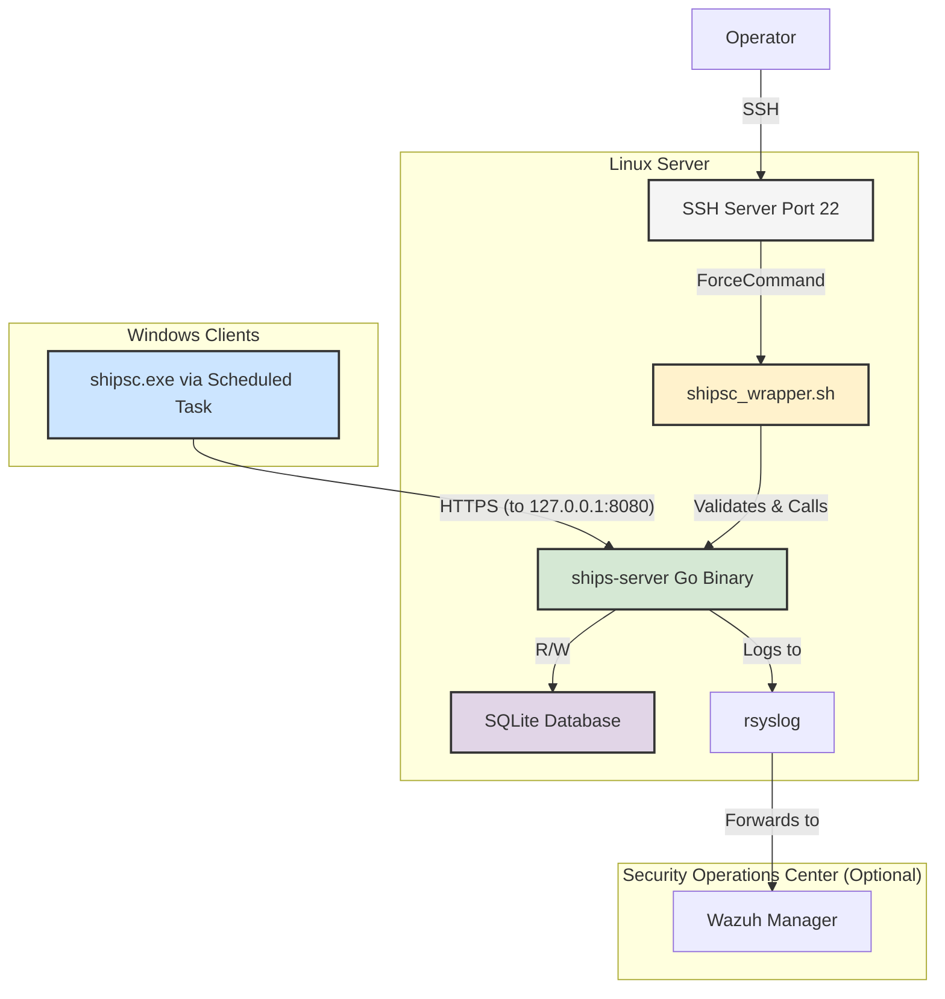

# System Patterns: SHIPS2-Go

## System Architecture
The SHIPS2-Go system is built on a client-server model with a strong emphasis on security through isolation and a restricted access model.

## Key Design Patterns & Decisions

1.  **API Isolation (Localhost Binding):**
    -   **Pattern:** The `ships-server` Go application is hard-coded to bind to `127.0.0.1:8080`.
    -   **Decision:** This is a critical security decision. It ensures the API is never directly exposed to the network, preventing a wide range of common web application attacks. All interaction must go through the designated SSH wrapper.

2.  **SSH ForceCommand as a Secure Gateway:**
    -   **Pattern:** Operator access is managed via a dedicated, non-privileged user (`shipscmd`) whose SSH key is configured with a `command="..."` directive in `authorized_keys`.
    -   **Decision:** This pattern transforms SSH from a general-purpose shell into a restricted, application-specific gateway. It prevents operators from gaining shell access and limits them to the exact functionality exposed by the `shipsc_wrapper.sh` script.

3.  **Wrapper Script for Validation & Abstraction:**
    -   **Pattern:** The `shipsc_wrapper.sh` script acts as a validation and abstraction layer between the SSH command and the backend API.
    -   **Decision:** This decouples the SSH entry point from the Go application. It allows for robust input validation (e.g., for hostnames, command types) in a simple shell script, protecting the Go application from malformed or malicious inputs. It also handles the translation of SSH commands to the appropriate local API calls.

4.  **Single-Binary Deployment:**
    -   **Pattern:** The project leverages Go's cross-compilation and static linking capabilities to produce single, dependency-free binaries for both the client (`shipsc.exe`) and server (`ships-server`).
    -   **Decision:** This drastically simplifies deployment and reduces the attack surface. There are no language runtimes (like Ruby or Python) or container engines (like Docker) to install or maintain.

5.  **Embedded Database (SQLite):**
    -   **Pattern:** SQLite is used as the embedded database for storing machine data, passwords, and audit logs.
    -   **Decision:** This aligns with the goal of simplicity. It removes the need for a separate database server, simplifying setup and backup procedures. The entire state of the application is contained within a single file.

6.  **Structured Logging for Auditing:**
    -   **Pattern:** All significant events are logged in a structured JSON format.
    -   **Decision:** Structured logs are machine-readable, making them easy to parse, forward, and analyze. This is essential for the Wazuh integration, as it allows for the creation of precise detection rules based on specific JSON fields (e.g., `actor`, `action`, `remote_addr`).
